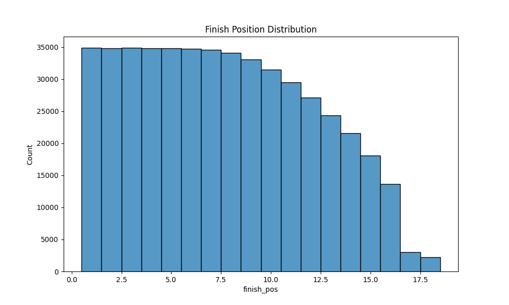
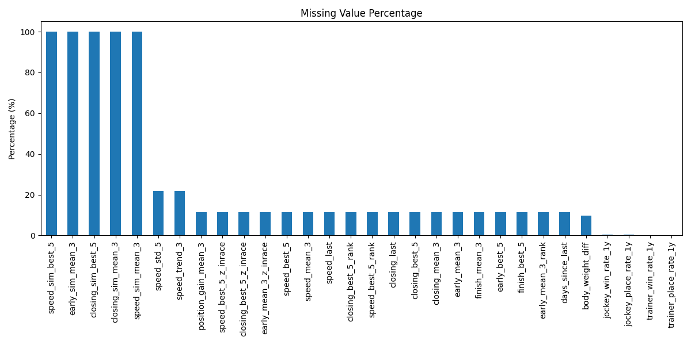
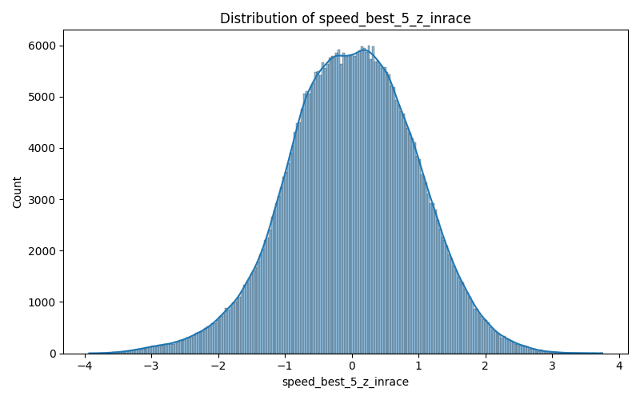
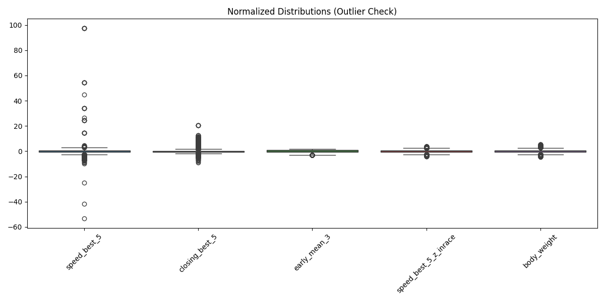
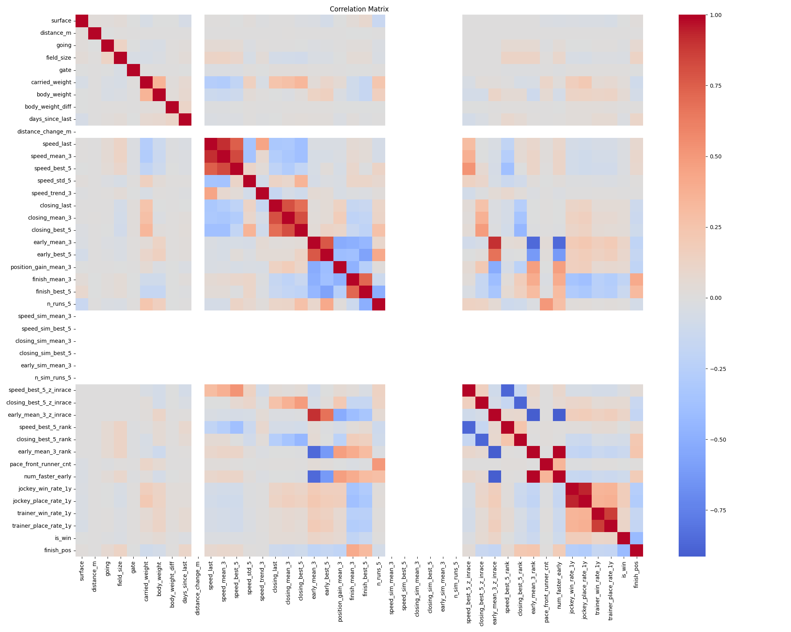

# Training Data Analysis Report

**Date:** 2026-02-08
**Dataset:** `data/train.parquet`
**Total Samples:** 482,123

## 1. Label Distribution
- **Win Ratio (`is_win=1`):** 7.24%
  - This is consistent with an average field size of ~13.8 horses.
  

## 2. Missing Values (CRITICAL Findings)
Significant missing values were found, most notably the "Similar Condition" features.

| Feature Pattern | Missing Rate | Comment |
|-----------------|--------------|---------|
| `*_sim_*` (e.g., `speed_sim_best_5`) | **100.0%** | **CRITICAL:** Feature generation logic for similar conditions is likely broken or too strict. |
| `n_sim_runs_5` | **100.0%** (all 0) | No similar runs found for any horse. |
| `speed_std_5` | 21.9% | Expected for horses with < 2 runs. |
| Basic Stats (`*_best_5`, etc.) | ~11.4% | Expected for Newcomers or those with insufficient history. |

## 3. Numeric Distributions
- **Speed Index (In-Race Z-Score):**
  - Range looks healthy (Max ~3.75). No extreme outliers > 10.
  

- **Outliers Check:**
  - Normalized boxplots show some outliers but within expected ranges for biological/performance data.
  

## 4. Correlation Analysis
Top features correlated with `is_win`:
(See `figures/correlation_matrix.png` for full matrix)

- Strongest positive correlations: `speed_best_5_z_inrace`, `closing_best_5_z_inrace`
- Strongest negative correlations: `speed_best_5_rank` (Lower rank is better)

## 5. Next Steps
1. **Investigate `*_sim_*` features:** The 100% missing rate indicates a bug in `build_features.py` (Rule `is_similar_condition` might be too strict or logic flow is flawed).
2. **Imputation Strategy:** Decide how to handle the ~11% missing for basic stats (Fill with 0 or mean, or use a separate "Newcomer" flag).
