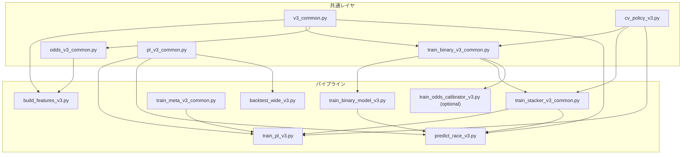

# v3 全体アーキテクチャ

> **スコープ**: システム概要、責務分割、データフロー

---

## 1. システム概要

### 1.1 目的

v3 の default main path を次の 3 層に整理する。

1. **base binary**: `win` / `place` を LightGBM / XGBoost / CatBoost の 6 本で学習する
2. **strict temporal stacker**: horse-level の `p_win_stack`, `p_place_stack` を生成する
3. **PL ranking layer**: stacker 出力を主入力として順位分布を学習し、`pl_score -> p_top3 -> p_wide` を計算する

grouped reference-only meta は `meta_default` profile で比較可能だが、PL の default main path では使わない。

### 1.2 設計原則

| 原則 | 内容 |
|---|---|
| **リーク防止（最優先）** | 全ステージで as-of 整合性を厳守し、未来情報の混入をアサーションで検出する |
| **OOF 保存** | 後段モデルの学習入力には OOF / holdout / inference 予測のみを使い、同年 fitted 値は downstream に流さない |
| **binary fixed4** | base binary の標準評価条件は `fixed_sliding` / `train_window_years=4` |
| **stacker strict temporal** | stacker は `capped_expanding` / `min_train_years=2` / `max_train_years=4` を使う |
| **PL fixed3** | PL の標準評価条件は `fixed_sliding` / `train_window_years=3`。stacker OOF 年が不足する場合は OOF 0 fold を許容し、holdout/final 学習だけ継続する |
| **stack-default contract** | PL の default 入力は raw base 6 本直結ではなく `p_win_stack`, `p_place_stack`, `place_width_log_ratio`, interaction block から作る |
| **t10 operational path** | 運用推論の最終出力は t10 契約を維持する。stacker の市場入力は `t20/t15/t10` snapshot までで、final odds は default 学習に入れない |
| **feature contract** | 実際の学習投入列は `feature_registry_v3.py` と feature manifest で固定し、`features_v3` の列存在だけでは決めない |

### 1.3 ディレクトリ構成

```text
scripts_v3/
├── v3_common.py
├── cv_policy_v3.py
├── build_features_v3.py
├── feature_registry_v3.py
├── train_binary_model_v3.py
├── train_binary_v3_common.py
├── train_win_{lgbm,xgb,cat}_v3.py
├── train_place_{lgbm,xgb,cat}_v3.py
├── train_stacker_v3_common.py
├── train_win_stack_v3.py
├── train_place_stack_v3.py
├── train_meta_v3_common.py
├── train_win_meta_v3.py
├── train_place_meta_v3.py
├── metrics_benter_v3_common.py
├── odds_v3_common.py
├── train_odds_calibrator_v3.py
├── train_pl_v3.py
├── pl_v3_common.py
├── predict_race_v3.py
└── backtest_wide_v3.py
```

### 1.4 モジュール依存関係



---

## 2. データフロー

### 2.1 default main path

```text
data/features_base.parquet
    │
    ▼ build_features_v3.py
data/features_v3.parquet
    │
    ├── train_win_{lgbm,xgb,cat}_v3.py
    │   └── data/oof/win_{lgbm,xgb,cat}_oof.parquet
    │
    ├── train_place_{lgbm,xgb,cat}_v3.py
    │   └── data/oof/place_{lgbm,xgb,cat}_oof.parquet
    │
    ├── train_win_stack_v3.py
    │   └── data/oof/win_stack_oof.parquet
    │
    ├── train_place_stack_v3.py
    │   └── data/oof/place_stack_oof.parquet
    │
    └── features_v3 + strict temporal stack OOF/holdout を merge
        │
        ▼ train_pl_v3.py
    data/oof/pl_v3_oof.parquet
    data/oof/pl_v3_holdout_2025_pred.parquet
    data/oof/v3_pipeline_year_coverage.json
        │
        ├── backtest_wide_v3.py
        └── predict_race_v3.py
```

### 2.2 comparison path

- `train_{win,place}_meta_v3.py` は grouped reference-only meta を生成する
- `train_odds_calibrator_v3.py` は odds 由来確率の比較用校正を行う
- これらは `meta_default` profile で比較可能だが、unsuffixed artifact の default route では使わない

### 2.3 推論順

運用推論の順序は次で固定する。

1. base binary 推論
2. stacker 推論
3. PL scoring
4. Monte Carlo による `p_top3`, `p_wide`

### 2.4 入出力一覧

| スクリプト | 主入力 | 主出力 |
|---|---|---|
| `build_features_v3.py` | `data/features_base.parquet` | `data/features_v3.parquet`, `data/features_v3_meta.json` |
| `train_win_lgbm_v3.py` など | `data/features_v3.parquet` | `data/oof/{task}_{model}_oof.parquet`, `models/*_bundle_meta_v3.json` |
| `train_win_stack_v3.py` | `data/features_v3.parquet` + win base OOF/holdout | `data/oof/win_stack_oof.parquet`, `data/holdout/win_stack_holdout_pred_v3.parquet`, `models/win_stack_bundle_meta_v3.json` |
| `train_place_stack_v3.py` | `data/features_v3.parquet` + place base OOF/holdout | `data/oof/place_stack_oof.parquet`, `data/holdout/place_stack_holdout_pred_v3.parquet`, `models/place_stack_bundle_meta_v3.json` |
| `train_pl_v3.py` | `data/features_v3.parquet` + stacker OOF/holdout | `data/oof/pl_v3_oof.parquet`, `data/oof/pl_v3_holdout_2025_pred.parquet`, `data/oof/v3_pipeline_year_coverage.json`, `models/pl_v3_recent_window.joblib` |
| `predict_race_v3.py` | 1レース特徴量 parquet | `data/predictions/race_v3_pred.parquet`, `data/predictions/race_v3_wide.parquet` |
| `backtest_wide_v3.py` | `pl_score` または `p_wide` を含む parquet | `data/backtest_v3/*.json` |
