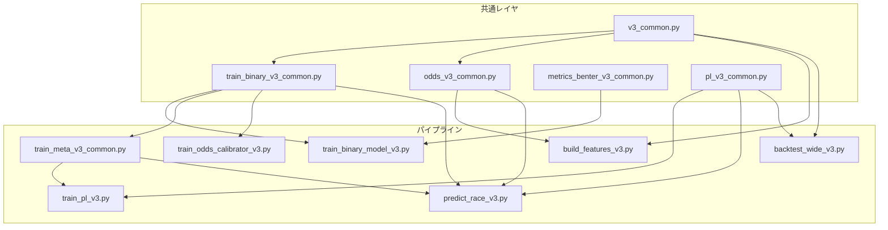

# v3 全体アーキテクチャ

> **スコープ**: システム概要、設計原則、データフロー

---

## 1. システム概要

### 1.1 目的

v2のデータ設計・リーク防止・Rolling年次CV・OOF保存の作法を踏襲しつつ、以下の予測パイプラインを構築する。

1. **単勝2値分類**（`y_win`）: LightGBM / XGBoost / CatBoost
2. **複勝2値分類**（`y_place`）: LightGBM / XGBoost / CatBoost
3. **meta結合器**（reference-only OOF）: `p_win_meta`, `p_place_meta`
4. **オッズ確率校正**（任意）: ロジスティック回帰 / Isotonic回帰
5. **PLランキングレイヤ**（uなし）: 線形スコア `s = w^T x` による Plackett-Luce 順位モデル
6. **ワイドROI評価**: Monte Carlo 推定 → Kelly 基準 → バックテスト

### 1.2 設計原則

| 原則 | 内容 |
|---|---|
| **リーク防止（最優先）** | 全ステージで as-of 整合性を厳守し、未来情報の混入をアサーションで検出する |
| **OOF保存** | 後段モデルの入力には OOF 予測のみを使用し、学習データの in-sample 予測は使わない |
| **Rolling年次CV** | `fixed_sliding` を標準とし、各 fold は直前4年のみを train に使って時系列順序を保証する |
| **t10運用パス** | 運用推論は発走10分前（t10）のオッズのみ許可し、final odds は検証専用とする |
| **feature contract** | 実際の学習投入列は feature registry と manifest で固定し、`features_v3` の列存在だけでは決めない |
| **meta-default contract** | PL の default 入力は raw 6本直結ではなく `p_win_meta + p_place_meta + p_win_odds_t10_norm + small context` とする |
| **reference-only meta CV** | meta は `race_id` grouped の通常CVで学習し、strict temporal OOF とは区別して扱う |

### 1.3 ディレクトリ構成

```text
scripts_v3/
├── v3_common.py
├── build_features_v3.py
├── feature_registry_v3.py
├── train_binary_model_v3.py
├── train_binary_v3_common.py
├── train_win_{lgbm,xgb,cat}_v3.py
├── train_place_{lgbm,xgb,cat}_v3.py
├── train_meta_v3_common.py
├── train_win_meta_v3.py
├── train_place_meta_v3.py
├── metrics_benter_v3_common.py
├── odds_v3_common.py
├── train_odds_calibrator_v3.py
├── train_pl_v3.py
├── pl_v3_common.py
├── predict_race_v3.py
└── backtest_wide_v3.py

docs/specs_v3/
├── v3_システム仕様書.md
├── v3_01_全体アーキテクチャ.md
├── v3_02_特徴量生成とオッズ仕様.md
├── v3_03_二値分類と校正仕様.md
├── v3_04_PL推論とワイドバックテスト仕様.md
└── v3_05_共通基盤と付録.md

docs/ops_v3/
├── Assumptions.md
├── スクリプトリファレンス.md
└── v3_run_report_*.md
```

### 1.4 モジュール依存関係



---

## 2. データフロー

### 2.1 全体パイプライン

```text
data/features_v2.parquet
    │
    ▼ build_features_v3.py
data/features_v3.parquet  ──────────────────────────────────────┐
    │                                                           │
    ├── train_win_{lgbm,xgb,cat}_v3.py                          │
    │   └── data/oof/win_{lgbm,xgb,cat}_oof.parquet             │
    │                                                           │
    ├── train_place_{lgbm,xgb,cat}_v3.py                        │
    │   └── data/oof/place_{lgbm,xgb,cat}_oof.parquet           │
    │                                                           │
    ├── train_{win,place}_meta_v3.py                            │
    │   ├── data/oof/{win,place}_meta_oof.parquet               │
    │   └── data/holdout/{win,place}_meta_holdout_pred_v3.parquet│
    │                                                           │
    ├── train_odds_calibrator_v3.py（任意）                      │
    │   └── data/oof/odds_win_calibration_oof.parquet           │
    │                                                           │
    └── features_v3 + 上記OOF予測をマージ ─────────────────────┘
        │
        ▼ train_pl_v3.py
    data/oof/pl_v3_oof.parquet
    data/oof/pl_v3_wide_oof.parquet
        │
        ▼ backtest_wide_v3.py
    data/backtest_v3/backtest_wide_v3_*.json

    ▼ predict_race_v3.py（運用推論）
    data/predictions/race_v3_pred.parquet
    data/predictions/race_v3_wide.parquet
```

### 2.2 入出力一覧

| スクリプト | 主入力 | 主出力 |
|---|---|---|
| `build_features_v3.py` | `data/features_v2.parquet` | `data/features_v3.parquet`, `data/features_v3_meta.json` |
| `train_win_lgbm_v3.py` | `data/features_v3.parquet` | `data/oof/win_lgbm_oof.parquet`, `models/win_lgbm_v3.txt`, `models/win_lgbm_bundle_meta_v3.json`, `models/win_lgbm_feature_manifest_v3.json` |
| `train_win_meta_v3.py` | `data/features_v3.parquet` + raw OOF/holdout parquet 群 | `data/oof/win_meta_oof.parquet`, `data/holdout/win_meta_holdout_pred_v3.parquet`, `models/win_meta_v3.pkl` |
| `train_odds_calibrator_v3.py` | `data/features_v3.parquet` | `data/oof/odds_win_calibration_oof.parquet`, `models/odds_win_calibrators_v3.pkl` |
| `train_pl_v3.py` | `data/features_v3.parquet` + OOF parquet 群 | `data/oof/pl_v3_oof.parquet`, `data/oof/pl_v3_holdout_2025_pred.parquet`, `data/oof/pl_v3_wide_oof.parquet`, `models/pl_v3_recent_window.joblib` |
| `predict_race_v3.py` | 1レース特徴量 parquet | `data/predictions/race_v3_pred.parquet`, `data/predictions/race_v3_wide.parquet` |
| `backtest_wide_v3.py` | wide OOF parquet または horse-level parquet | `data/backtest_v3/*.json` |
