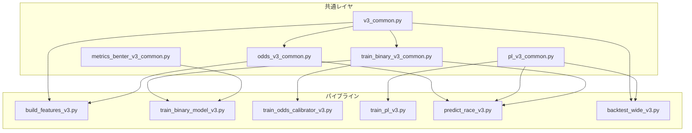

# v3 システム仕様書

> **ステータス**: コードリバースエンジニアリングにより作成（2026-03-04）
> **対象**: `scripts_v3/` 配下の全スクリプト + `docs/ops_v3/` 運用ドキュメント

---

## 1. システム概要

### 1.1 目的

v2のデータ設計・リーク防止・Rolling年次CV・OOF保存の作法を踏襲しつつ、以下の予測パイプラインを構築する。

1. **単勝2値分類**（`y_win`）: LightGBM / XGBoost / CatBoost
2. **複勝2値分類**（`y_place`）: LightGBM / XGBoost / CatBoost
3. **オッズ確率校正**（任意）: ロジスティック回帰 / Isotonic回帰
4. **PLランキングレイヤ**（uなし）: 線形スコア `s = w^T x` によるPlackett-Luce順位モデル
5. **ワイドROI評価**: Monte Carlo推定 → Kelly基準 → バックテスト

### 1.2 設計原則

| 原則 | 内容 |
|---|---|
| **リーク防止（最優先）** | 全ステージでas-of整合性を厳守。未来情報の混入をアサーションで検出 |
| **OOF保存** | 後段モデルの入力には OOF 予測のみを使用（学習データの予測値は使わない） |
| **Rolling年次CV** | v2の `build_rolling_year_folds()` を踏襲。時系列順序を保証 |
| **t10運用パス** | 運用推論は「発走10分前」（t10）のオッズのみ許可。finalオッズは検証専用 |

### 1.3 ディレクトリ構成

```
scripts_v3/
├── v3_common.py                    # 共通ユーティリティ（CV, Bankroll, パスなど）
├── build_features_v3.py            # 特徴量生成（v2 → v3）
├── train_binary_model_v3.py        # 2値分類学習の本体
├── train_binary_v3_common.py       # 2値分類の共通関数
├── train_win_{lgbm,xgb,cat}_v3.py  # 単勝ラッパー（各15行）
├── train_place_{lgbm,xgb,cat}_v3.py# 複勝ラッパー（各15行）
├── metrics_benter_v3_common.py     # Benter R* 評価指標
├── odds_v3_common.py               # オッズスナップショット処理
├── train_odds_calibrator_v3.py     # オッズ確率校正
├── train_pl_v3.py                  # Plackett-Luceランキング学習
├── pl_v3_common.py                 # PL共通（NLL, MC推定, torch/numpyフォールバック）
├── predict_race_v3.py              # 1レース推論（運用=t10パス）
└── backtest_wide_v3.py             # ワイドバックテスト（Kelly, ROI評価）

docs/specs_v3/
├── v3_実装仕様.md                  # 元の簡易仕様（本書で置換）
└── v3_システム仕様書.md            # 本書

docs/ops_v3/
├── Assumptions.md                  # 推定前提の一覧
├── スクリプトリファレンス.md        # 実行コマンド集
└── v3_run_report_2026-03-04.md     # 実行結果レポート
```

### 1.4 モジュール依存関係



---

## 2. データフロー

### 2.1 全体パイプライン

```
data/features_v2.parquet
    │
    ▼ build_features_v3.py
data/features_v3.parquet  ──────────────────────────────────────┐
    │                                                           │
    ├── train_win_{lgbm,xgb,cat}_v3.py                          │
    │   └── data/oof/win_{lgbm,xgb,cat}_oof.parquet             │
    │                                                           │
    ├── train_place_{lgbm,xgb,cat}_v3.py                        │
    │   └── data/oof/place_{lgbm,xgb,cat}_oof.parquet           │
    │                                                           │
    ├── train_odds_calibrator_v3.py（任意）                       │
    │   └── data/oof/odds_win_calibration_oof.parquet            │
    │                                                           │
    └── features_v3 + 上記OOF予測をマージ ──────────────────────┘
        │
        ▼ train_pl_v3.py
    data/oof/pl_v3_oof.parquet
    data/oof/pl_v3_wide_oof.parquet
        │
        ▼ backtest_wide_v3.py
    data/backtest_v3/backtest_wide_v3_*.json

    ▼ predict_race_v3.py（運用推論）
    data/predictions/race_v3_pred.parquet
    data/predictions/race_v3_wide.parquet
```

### 2.2 入出力一覧

| スクリプト | 主入力 | 主出力 |
|---|---|---|
| `build_features_v3.py` | `data/features_v2.parquet` | `data/features_v3.parquet`, `data/features_v3_meta.json` |
| `train_win_lgbm_v3.py` | `data/features_v3.parquet` | `data/oof/win_lgbm_oof.parquet`, `models/win_lgbm_v3.txt`, `models/win_lgbm_bundle_meta_v3.json` |
| `train_odds_calibrator_v3.py` | `data/features_v3.parquet` | `data/oof/odds_win_calibration_oof.parquet`, `models/odds_win_calibrators_v3.pkl` |
| `train_pl_v3.py` | `data/features_v3.parquet` + OOF parquet群 | `data/oof/pl_v3_oof.parquet`, `data/oof/pl_v3_wide_oof.parquet`, `models/pl_v3_recent_window.joblib` |
| `predict_race_v3.py` | 1レース特徴量parquet | `data/predictions/race_v3_pred.parquet` |
| `backtest_wide_v3.py` | wide_oof parquet or horse-level parquet | `data/backtest_v3/*.json` |

---

## 3. 特徴量生成（`build_features_v3.py`）

### 3.1 入力

- `data/features_v2.parquet`（v2の特徴量マトリクス）
  - 必須列: `race_id`, `horse_no`, `target_label`, `race_date`, `field_size`

### 3.2 追加列

| 列名 | 定義 | 型 |
|---|---|---|
| `y_win` | `target_label == 3`（1着） | int |
| `y_place` | `target_label >= 1`（3着以内） | int |
| `finish_pos` | DB `core.result` から結合 | float (NaN許容) |
| `odds_win_final` | finalスナップショットの単勝オッズ | float |
| `p_win_odds_final_raw` | `1 / odds_win_final` | float |
| `p_win_odds_final_norm` | レース内正規化した暗示確率 | float |
| `odds_win_t10` | t10スナップショットの単勝オッズ | float |
| `p_win_odds_t10_raw` | `1 / odds_win_t10` | float |
| `p_win_odds_t10_norm` | レース内正規化した暗示確率 | float |
| `odds_final_data_kbn` | final snapshotの`data_kbn` | int |
| `odds_t10_data_kbn` | t10 snapshotの`data_kbn` | int |
| `odds_final_announce_dt` | finalの発表日時 | datetime |
| `odds_t10_announce_dt` | t10の発表日時 | datetime |
| `odds_t10_asof_dt` | t10の基準時点（`race_start - 10min`） | datetime |

### 3.3 オッズスナップショット方針（`odds_v3_common.py`）

#### final（検証用）
- `data_kbn` 優先順位: `4 > 3 > 2 > 1`
- `announce <= race_start` の範囲で最新を採用
- 用途: Benter R*評価、校正学習

#### t10（運用想定）
- `as_of = race_start - 10min` を基準時点とする
- `announce <= as_of` の範囲で最新を採用
- 用途: 運用推論、PL学習

#### 欠損処理
- オッズが`NULL / 0 / 負`の場合は欠損扱い
- レース内で再正規化（全欠損なら NaN）

### 3.4 リーク防止アサーション

`assert_t10_no_future_reference()` により、t10の `announce_dt <= asof_dt` を全行で検証。

### 3.5 メタデータ出力

`features_v3_meta.json` に以下を記録:
- 入出力パス、行数、レース数、列一覧
- カバレッジ（`finish_pos`, odds各列の非NaN率）
- コードハッシュ（`build_features_v3.py` + `odds_v3_common.py`）

---

## 4. 2値分類（単勝/複勝）

### 4.1 アーキテクチャ（`train_binary_model_v3.py`）

6つの薄いラッパースクリプトが `main(default_task=..., default_model=...)` を呼び出す構造:

```
train_win_lgbm_v3.py  → main(task="win",   model="lgbm")
train_win_xgb_v3.py   → main(task="win",   model="xgb")
train_win_cat_v3.py    → main(task="win",   model="cat")
train_place_lgbm_v3.py → main(task="place", model="lgbm")
train_place_xgb_v3.py  → main(task="place", model="xgb")
train_place_cat_v3.py  → main(task="place", model="cat")
```

### 4.2 ラベル定義

| task | ラベル列 | 定義 | base rate (参考) |
|---|---|---|---|
| `win` | `y_win` | 1着 (`target_label == 3`) | ~6-7% |
| `place` | `y_place` | 3着以内 (`target_label >= 1`) | ~20-21% |

### 4.3 特徴量選択

```python
IDENTIFIER_COLUMNS = {
    "race_id", "horse_id", "horse_no", "race_date",
    "t_race", "year", "target_label", "finish_pos",
    "y_win", "y_place",
}
```

- 上記IDカラムを除外した全数値列を特徴量として使用
- `--drop-entity-id-features` オプションで `jockey_key`, `trainer_key` を追加除外可能
- 非数値列は `pd.to_numeric(errors="coerce")` で強制変換

### 4.4 Cross-Validation

- **方式**: Rolling年次CV（`build_rolling_year_folds()`）
- **デフォルト**: `train_window_years=5`, `holdout_year=2025`
- **整合性チェック**: `assert_fold_integrity()` で train/valid間の年重複・race_id重複を検出

#### fold生成ロジック

```
holdout_year=2025, train_window_years=5 の場合:
  fold 0: train=[2016,2017,2018,2019,2020] → valid=2021
  fold 1: train=[2017,2018,2019,2020,2021] → valid=2022
  fold 2: train=[2018,2019,2020,2021,2022] → valid=2023
  fold 3: train=[2019,2020,2021,2022,2023] → valid=2024
year >= holdout_year は CV・最終学習から除外
```

### 4.5 モデルハイパーパラメータ

#### LightGBM

| パラメータ | デフォルト |
|---|---|
| `objective` | binary |
| `n_estimators` | 2000 |
| `learning_rate` | 0.05 |
| `num_leaves` | 63 |
| `min_child_samples` | 20 |
| `early_stopping_rounds` | 100 |

#### XGBoost

| パラメータ | デフォルト |
|---|---|
| `objective` | binary:logistic |
| `n_estimators` | 2000 |
| `learning_rate` | 0.05 |
| `max_depth` | 6 |
| `min_child_weight` | 1.0 |
| `tree_method` | hist |
| `early_stopping_rounds` | 100 |

#### CatBoost

| パラメータ | デフォルト |
|---|---|
| `loss_function` | Logloss |
| `iterations` | 2000 |
| `learning_rate` | 0.05 |
| `depth` | 8 |
| `l2_leaf_reg` | 3.0 |
| `od_type` | Iter |
| `od_wait` | 100 |

### 4.6 最終モデル

CV完了後、以下の2つの最終モデルを学習:

1. **recent_window**: 直近 `train_window_years + 1` 年分のデータで学習（運用推論用）
2. **all_years**: holdout除外後の全年データで学習（アンサンブル用途）

最終モデルのブースト回数は CV fold の `best_iteration` の中央値を使用。

### 4.7 OOF出力

| 列 | 内容 |
|---|---|
| `race_id`, `horse_id`, `horse_no` | 識別子 |
| `t_race`, `race_date`, `field_size` | レース情報 |
| `target_label`, `y_win` / `y_place` | ラベル |
| `p_win_{model}` / `p_place_{model}` | 予測確率 |
| `fold_id`, `valid_year` | fold情報 |

### 4.8 評価指標

| 指標 | 説明 |
|---|---|
| `logloss` | Binary cross-entropy |
| `brier` | Brier score |
| `auc` | ROC-AUC |
| `ece` | Expected Calibration Error（10ビン） |
| `reliability` | キャリブレーションビン情報（10ビン） |

---

## 5. Benter R*（`metrics_benter_v3_common.py`）

### 5.1 対象

単勝タスク（`task="win"`）のみ。各foldのvalid上で計算。

### 5.2 手順

1. 予測確率 `p` を clip → logit変換: `score = logit(clip(p, ε, 1-ε))`, ε=1e-6
2. レース内 softmax（温度β）: `c_i(β) = exp(β·s_i) / Σ_j exp(β·s_j)`
3. モデルNLL: `NLL_model = -Σ_race log(c_winner)`
4. ヌルNLL: `NLL_null = Σ_race log(field_size)`
5. R* = `1 - NLL_model / NLL_null`

### 5.3 βの最適化

- **対象データ**: fold内のtrain予測のみ（in-sample）
- **探索方法**: SciPy不使用
  1. log スケール等間隔グリッド（81点, [0.01, 100.0]）
  2. 最良グリッド点の前後区間で黄金分割探索（48反復）
- **報告**: `β̂` での R* と `β=1`（温度スケール無し）での R* を両方出力

---

## 6. オッズ確率校正（`train_odds_calibrator_v3.py`）

### 6.1 概要

オッズ由来の暗示確率（`p_win_odds_t10_norm`, `p_win_odds_final_norm`）を `y_win` に対して校正する。

### 6.2 校正手法

| 手法 | 実装 |
|---|---|
| `logreg` | `LogisticRegression(C=1e6)` で `logit(p)` → `y_win` を学習 |
| `isotonic` | `IsotonicRegression(out_of_bounds="clip")` で `p` → `y_win` を学習 |

### 6.3 CV方式

2値分類と同一の Rolling年次CV（`train_window_years=5`, `holdout_year=2025`）。

### 6.4 出力

- OOF: `data/oof/odds_win_calibration_oof.parquet`
  - 各 `(score_col, method)` の組み合わせについて校正後確率列を追加
- メトリクス: `data/oof/odds_win_calibration_cv_metrics.json`
- モデル: `models/odds_win_calibrators_v3.pkl`（joblibシリアライズ）

---

## 7. Plackett-Luce ランキング（`train_pl_v3.py` + `pl_v3_common.py`）

### 7.1 モデル定義

- **スコア関数**: `s_{r,i} = w^T x_{r,i}`（線形、馬ID固定効果 `u` なし）
- **損失関数**: Plackett-Luce 負の対数尤度
  ```
  NLL = -Σ_race Σ_{k=1}^{n-1} [s_{π(k)} - log(Σ_{j=k}^{n} exp(s_{π(j)}))]
  ```
  ここで `π` は観測着順

### 7.2 最適化

| 項目 | 値 |
|---|---|
| バックエンド | PyTorch（optional）、なければ NumPy gradient descent フォールバック |
| エポック数 | 300 |
| 学習率 | 0.05 |
| L2正則化 | 1e-5 |
| seed | 42 |

#### NumPyフォールバック

- 勾配を手動計算（softmax微分）
- 学習率をAdamライクに動的調整（1e-3 ~ 5e-5 の段階的減衰）

### 7.3 入力特徴量

PL学習の入力は以下を統合:

1. **v3特徴量ベース**: `features_v3.parquet` のうちID列・ラベル・日時列を除外した数値列
2. **前段OOF予測**: `p_win_{lgbm,xgb,cat}`, `p_place_{lgbm,xgb,cat}`
3. **オッズ校正結果**（任意）: `p_win_odds_*_cal_*`
4. **finalオッズ列除外制御**: `--include-final-odds` で制御（デフォルト除外）

> [!IMPORTANT]
> PL学習入力には **OOF予測のみ** を使用。OOFが欠ける行はPL学習対象から除外される。

### 7.4 前処理

- 欠損値: 各特徴量の中央値で補完
- 標準化: 平均0・標準偏差1（train foldの統計量を使用）
- 標準偏差=0の特徴量はスケーリングをスキップ（除算 / 1.0）

### 7.5 CV方式

- Rolling年次CV（2値分類と同一構造）
- **推奨デフォルト**: `train_window_years=2`（OOF行が確保できる年が限られるため）
- holdout除外ルールも同一

### 7.6 Monte Carlo 推定

#### p_top3（複勝確率）

「PL分布からの独立サンプリングで、各馬がtop-3に入る確率」をMonte Carlo推定:

```python
mc_samples = 10_000  # デフォルト
top_k = 3
```

1. `pl_score` から Gumbel(0,1) を加算して順位サンプルを生成
2. 各サンプルでtop-k に入る回数をカウント
3. 出現頻度を確率として推定

#### p_wide（ワイド的中確率）

2頭の組み合わせ (i,j) がともにtop-3に入る確率:
- 上記MC サンプルの副産物として計算
- 出力は `(race_id, horse_no_1, horse_no_2, p_wide)` のペアレベル

#### 乱数シード

レース再現性のため `race_id + global_seed` から決定論的 RNG を生成:
```python
rng = np.random.default_rng(
    int(hashlib.sha256(f"{seed}_{race_id}".encode()).hexdigest()[:8], 16) % (2**32)
)
```

### 7.7 出力

| ファイル | 内容 |
|---|---|
| `pl_v3_oof.parquet` | horse-level OOF（`pl_score`, `p_top3`） |
| `pl_v3_wide_oof.parquet` | pair-level OOF（`p_wide`） |
| `pl_v3_cv_metrics.json` | fold別のPL NLL, top3_logloss, top3_auc |
| `pl_v3_recent_window.joblib` | 運用推論用モデル artifacts |
| `pl_v3_all_years.joblib` | 全年データモデル |
| `pl_v3_bundle_meta.json` | バンドルメタ情報 |

### 7.8 モデルアーティファクト構成

`joblib` でシリアライズされるアーティファクトの内容:

```python
{
    "feature_columns": [...],      # 特徴量列名
    "weights": np.ndarray,         # 学習済み重みベクトル
    "preprocess": {
        "median": {...},           # 欠損補完用の中央値
        "mean": {...},             # 標準化の平均
        "std": {...},              # 標準化の標準偏差
    },
    "train_years": [...],
    "train_rows": int,
    "train_races": int,
    "config": {...},
}
```

---

## 8. 1レース推論（`predict_race_v3.py`）

### 8.1 運用パス

```
入力（1レース特徴量）
  → base model推論（win/place × lgbm/xgb/cat → 6列追加）
  → odds校正（任意、calibratorモデルから校正後確率列を追加）
  → PL scoring（w^T x → pl_score）
  → Monte Carlo推定 → p_top3, （任意）p_wide
  → 出力
```

### 8.2 制約事項

- **入力は1レースのみ**（`race_id` が1種類であること。複数レースはエラー）
- **t10パス強制**: PLモデルの特徴量に `_final_` を含む列があればエラーで停止
- **base model meta**: `models/{task}_{model}_bundle_meta_v3.json` から特徴量列・モデルパスを読み取り

### 8.3 出力列

```
race_id, horse_id, horse_no, race_date,
odds_win_t10, p_win_odds_t10_raw, p_win_odds_t10_norm,
p_win_lgbm, p_win_xgb, p_win_cat,
p_place_lgbm, p_place_xgb, p_place_cat,
pl_score, p_top3
```

- `--emit-wide` 指定時: ペアレベル `(race_id, horse_no_1, horse_no_2, p_wide)` を追加出力

---

## 9. ワイドバックテスト（`backtest_wide_v3.py`）

### 9.1 概要

PL由来の `p_wide` を基に、ワイド馬券の購入シミュレーションとROI評価を行う。

### 9.2 入力モード

自動検出により2モードを切り替え:

| モード | 判定条件 | 内容 |
|---|---|---|
| **pair-level** | `p_wide` 列が存在 | `(race_id, horse_no_1, horse_no_2, p_wide)` を直接使用 |
| **horse-level** | `pl_score` 列が存在 | `pl_score` → MC推定 → `p_wide` を算出 |

### 9.3 データソース（DB結合）

| テーブル | 用途 |
|---|---|
| `core.o3_wide` | ワイドオッズ取得 |
| `core.payout` (`bet_type=5`) | ワイド払戻金取得 |
| `core.race` | レース日・開催時刻 |
| `core.runner` | horse_name取得 |

### 9.4 Bankroll管理（Kelly基準）

```python
@dataclass
class BankrollConfig:
    bankroll_init_yen: int = 1_000_000      # 初期資金
    kelly_fraction_scale: float = 0.25       # フラクショナル Kelly
    max_bets_per_race: int = 5               # レース当たり最大ベット数
    race_cap_fraction: float = 0.05          # レース当たり資金上限（5%）
    daily_cap_fraction: float = 0.2          # 日次資金上限（20%）
    bet_unit_yen: int = 100                  # ベット単位（100円）
    min_bet_yen: int = 100                   # 最小ベット
    max_bet_yen: int | None = None           # 最大ベット（None=上限なし）
```

#### Kelly fraction計算

```python
def kelly_fraction(probability, odds):
    edge = probability * odds - 1.0
    if edge <= 0.0:
        return 0.0
    return edge / (odds - 1.0)

fractional_kelly = kelly_fraction * kelly_fraction_scale
```

#### レース内配分

1. 候補ペアを `p_wide * odds - 1 > 0`（正のエッジ）でフィルタ
2. `p_wide` 閾値でさらにフィルタ（`--min-p-wide` + `--min-p-wide-stage`）
   - `candidate`: loosened閾値（全候補を絞る）
   - `selected`: 最終選択閾値（さらに厳選）
3. Kelly fraction × 資金 → ベット額を計算
4. レース上限（`race_cap_fraction`）、日次上限（`daily_cap_fraction`）で制限
5. 100円単位に切り捨て

### 9.5 シミュレーション

- レースを日付順に処理
- 各レースで「ベット → 払戻 → 資金更新」を繰り返し
- 月次集計（投入額、回収額、ROI、残高推移）

### 9.6 出力

| ファイル | 内容 |
|---|---|
| `backtest_wide_v3_*.json` | サマリ・月次明細・全ベット記録 |
| `backtest_wide_v3_*_meta.json` | 設定・品質指標・ドローダウン |

#### サマリ指標

```json
{
    "total_bet_yen": ...,
    "total_payout_yen": ...,
    "net_yen": ...,
    "roi": ...,
    "num_bets": ...,
    "num_hit": ...,
    "hit_rate": ...,
    "max_drawdown": ...,
    "final_bankroll_yen": ...
}
```

---

## 10. 共通ユーティリティ（`v3_common.py`）

### 10.1 パス管理

- `resolve_path(path_str)`: 相対パスを `PROJECT_ROOT` 基準で解決
- `save_json(path, payload)`: JSON 書き出し（indent=2, ensure_ascii=False）
- `hash_files(paths)`: SHA-256 ダイジェスト

### 10.2 Rolling年次CV

`build_rolling_year_folds(years, *, train_window_years, holdout_year) → list[FoldSpec]`

- holdout_year 以降の年を除外
- train窓が `train_window_years` に満たない場合もfold生成（窓が短くなる）
- `FoldSpec(fold_id, train_years, valid_year)` のリストを返す

### 10.3 整合性アサーション

- `assert_fold_integrity(train, valid, valid_year)`: 年重複・race_id重複の検出
- `assert_sorted(df)`: `race_id asc / horse_no asc` のソート検証

### 10.4 Bankroll / Kelly

- `kelly_fraction()`, `fractional_kelly_fraction()`
- `allocate_race_bets()`: レース内候補のKellyベット配分
- `compute_max_drawdown()`: エクイティカーブから最大DDを計算

---

## 11. テスト構成（`test_v3/`）

| テストファイル | 対象 |
|---|---|
| `test_v3_common.py` | `v3_common.py` の全ユーティリティ |
| `test_features_v3_no_leakage.py` | 特徴量生成のリーク防止アサーション |
| `test_benter_r2_v3.py` | Benter R* の計算正確性 |
| `test_pl_v3_wide_invariants.py` | PL wide推定の不変条件 |
| `test_backtest_wide_v3_smoke.py` | バックテストの基本動作 |
| `test_v3_cli_smoke.py` | CLIヘルプ起動のスモークテスト |

---

## 12. 既知の制限事項

> [!WARNING]
> 以下は現時点で認識されている制限であり、今後の改善対象。

1. **final/t10 分離の不完全性**: 現状の win/place モデルは `features_v3` の final/t10 odds列を両方含むため、厳密な「運用=t10のみ」にはモデル再設計が必要
2. **PL の馬ID固定効果なし**: `u`（馬固有パラメータ）は持たず、汎用特徴量のみで学習
3. **NumPyフォールバック**: `torch` 未導入環境では勾配降下法の品質が劣る可能性あり
4. **封印holdoutの消費**: 2025評価が実施済みのため、one-shot性が弱まっている

---

## 13. 依存関係

| パッケージ | 必須/任意 | 用途 |
|---|---|---|
| `pandas`, `numpy` | 必須 | データ処理全般 |
| `scikit-learn` | 必須 | メトリクス計算、odds校正 |
| `lightgbm` | 必須（win/place） | GBDT分類 |
| `xgboost` | 任意（`--extra xgboost`） | GBDT分類 |
| `catboost` | 任意（`--extra catboost`） | GBDT分類 |
| `torch` | 任意（`--extra torch`） | PL学習の高速化 |
| `joblib` | 必須 | PLモデル保存 |

---

## 14. 付録: CLIオプション一覧

### train_binary_model_v3.py

| オプション | 型 | デフォルト | 説明 |
|---|---|---|---|
| `--task` | choice | win | win / place |
| `--model` | choice | lgbm | lgbm / xgb / cat |
| `--input` | str | data/features_v3.parquet | 入力特徴量 |
| `--holdout-year` | int | 2025 | holdout年 |
| `--train-window-years` | int | 5 | 学習窓 |
| `--num-boost-round` | int | 2000 | 最大ブースト回数 |
| `--early-stopping-rounds` | int | 100 | EarlyStopping |
| `--seed` | int | 42 | 乱数シード |
| `--drop-entity-id-features` | flag | false | jockey/trainer除外 |
| `--holdout-input` | str | | holdout入力 |
| `--benter-eps` | float | 1e-6 | Benter clipイプシロン |

### train_pl_v3.py

| オプション | 型 | デフォルト | 説明 |
|---|---|---|---|
| `--features-input` | str | data/features_v3.parquet | v3特徴量 |
| `--train-window-years` | int | 3 | PL学習窓 |
| `--holdout-year` | int | 2025 | holdout年 |
| `--emit-wide-oof` | flag | false | wide OOF出力 |
| `--include-final-odds` | flag | false | finalオッズ含める |
| `--mc-samples` | int | 10000 | MC推定サンプル数 |

### backtest_wide_v3.py

| オプション | 型 | デフォルト | 説明 |
|---|---|---|---|
| `--input` | str | 必須 | 入力parquet |
| `--years` | str | all | 対象年（カンマ区切り） |
| `--holdout-year` | int | 2025 | holdout年 |
| `--min-p-wide` | float | | p_wide下限閾値 |
| `--min-p-wide-stage` | choice | candidate | candidate / selected |
| `--force` | flag | false | 上書き許可 |
| `--mc-samples` | int | 10000 | MC推定サンプル数 |
